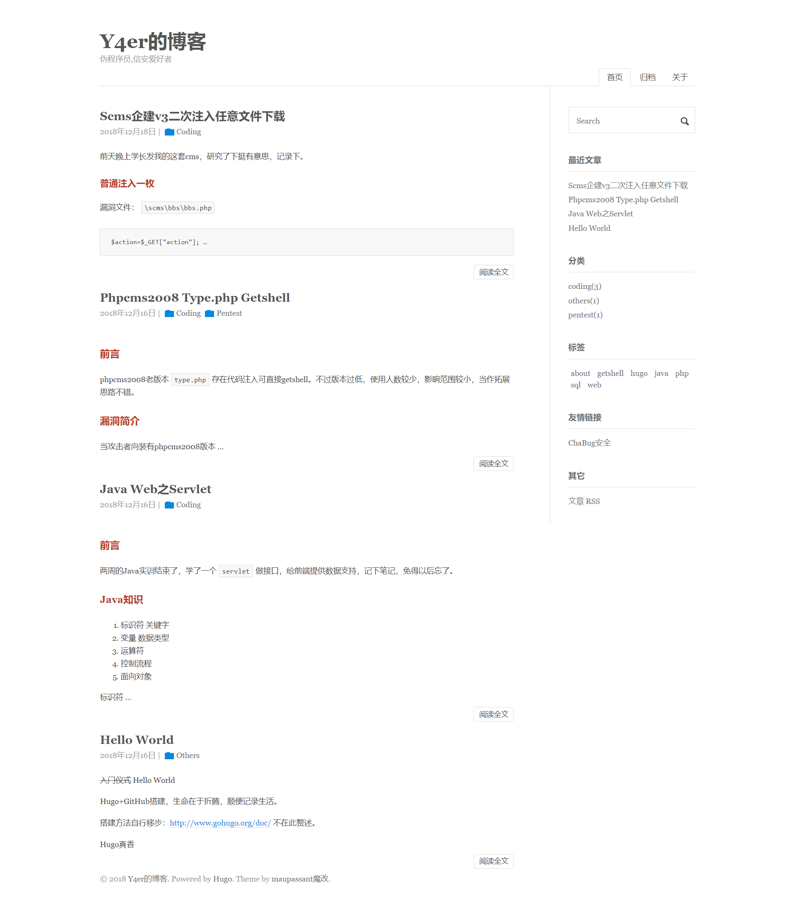

# Maupassant
Maupassant theme, ported to Hugo.

1. Preview: [flysnow blog](http://www.flysnow.org)
2. [中文文档](README.md)

A simple Hugo template with great performance on different devices, ported from a Typecho theme by [Cho](https://github.com/pagecho/maupassant/), forked and modified from [JokerQyou](https://github.com/JokerQyou/maupassant-hugo).

## Preview



## Features

## Installation

```bash
cd <YOUR Bolg Root Dir>
git clone https://github.com/rujews/maupassant-hugo themes/maupassant
```

## Configuration

#### Apply theme

```toml
theme = "maupassant"
```

#### Basic Configuration

```toml
baseURL = "http://www.flysnow.org"
languageCode = "zh-CN"
title = "飞雪无情的博客"
theme = "maupassant"

[author]
  name = "飞雪无情"

[params]
  author = "飞雪无情"
  subtitle = "专注于Android、Java、Go语言(golang)、移动互联网、项目管理、软件架构"
  keywords = "golang,go语言,go语言笔记,飞雪无情,java,android,博客,项目管理,python,软件架构,公众号,小程序"
  description = "专注于IT互联网，包括但不限于Go语言(golang)、Java、Android、Python、项目管理、抖音分析、软件架构等"
```

#### Menus

```toml
[menu]

  [[menu.main]]
    identifier = "books"
    name = "新书"
    url = "/books/"
    weight = 2

  [[menu.main]]
    identifier = "archives"
    name = "归档"
    url = "/archives/"
    weight = 3

  [[menu.main]]
    identifier = "about"
    name = "关于"
    url = "/about/"
    weight = 4
```

#### Friend Links

```toml
[[params.links]]
  title = "Android Gradle权威指南"
  name = "Android Gradle权威指南"
  url = "http://yuedu.baidu.com/ebook/14a722970740be1e640e9a3e"
[[params.links]]
  title = "常用开发工具CDN镜像"
  name = "常用开发工具CDN镜像"
  url = "http://mirrors.flysnow.org/"
```

#### Ads

```toml
[[params.ads]]
  title = "领取￥1888阿里云产品通用代金券"
  url = "https://promotion.aliyun.com/ntms/yunparter/invite.html?userCode=jdg9oj97"

[[params.ads]]
  title = "领取￥1888阿里云产品通用代金券"
  url = "https://promotion.aliyun.com/ntms/act/vmpt/aliyun-group/home.html?userCode=jdg9oj97"
  img = "https://img.alicdn.com/tfs/TB17qJhXpzqK1RjSZFvXXcB7VXa-200-126.jpg"
[[params.ads]]
  title = "领取￥1888阿里云产品通用代金券"
  url = "https://promotion.aliyun.com/ntms/act/enterprise-discount.html?userCode=jdg9oj97"
  img = "https://img.alicdn.com/tfs/TB1aDXhXpzqK1RjSZFvXXcB7VXa-259-194.jpg"
```

Ads Preview [http://www.flysnow.org/](http://www.flysnow.org/)

#### Google Analytics

```toml
googleAnalytics = "GA ID"
```

#### Disqus

```toml
disqusShortname = "yourdiscussshortname"
```

#### Page View Support

```toml
[params]
  busuanzi = true
```

## Contributing

All kinds of contributions (enhancements, new features, documentation & code improvements, issues & bugs reporting) are welcome.

Looking forward to your pull request.

## Maupassant on other platforms

+ Typecho：https://github.com/pagecho/maupassant/
+ Octopress：https://github.com/pagecho/mewpassant/
+ Farbox：https://github.com/pagecho/Maupassant-farbox/
+ Wordpress：https://github.com/iMuFeng/maupassant/
+ Ghost: https://github.com/LjxPrime/maupassant/
+ Hexo: https://github.com/tufu9441/maupassant-hexo
+ Hugo: https://github.com/rujews/maupassant-hugo
