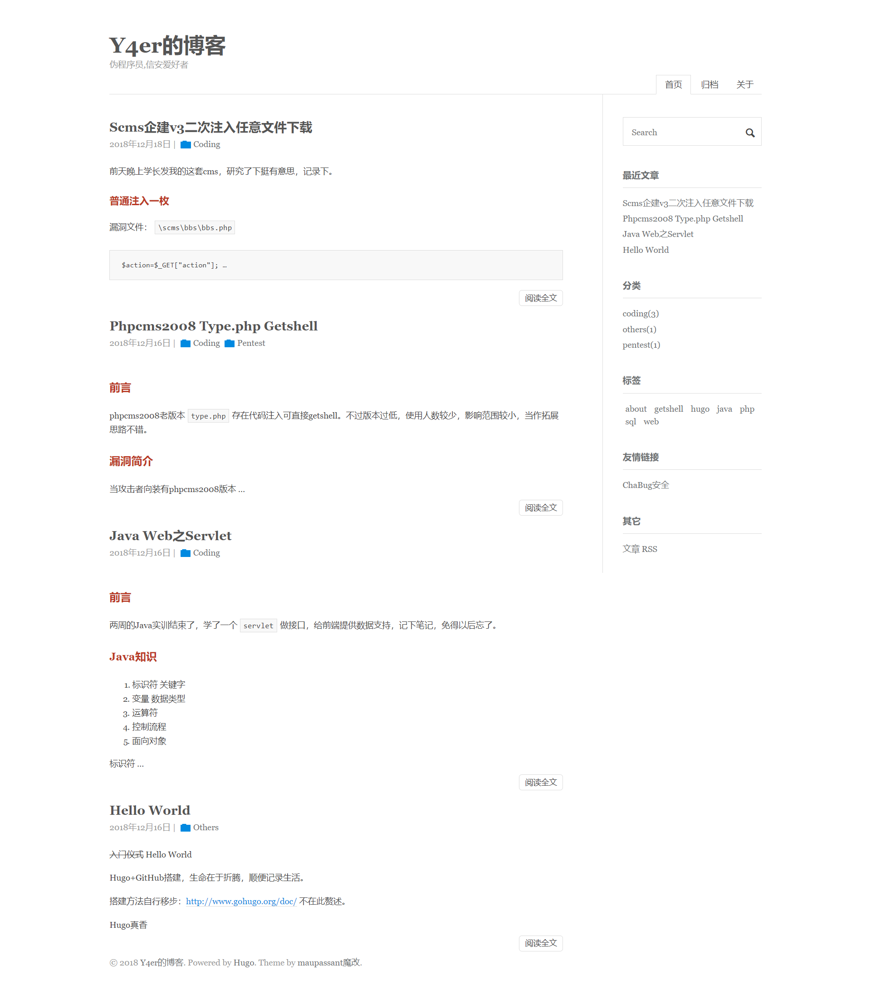

# Maupassant
Maupassant theme, ported to Hugo.

[预览效果](http://www.flysnow.com)｜[English Docs](README.md)

一款非常简洁、性能高的Hugo主题，适配不同的设备（PC，Mobile等）。 主要是基于 Typecho [Cho](https://github.com/pagecho/maupassant/), 从 [JokerQyou](https://github.com/JokerQyou/maupassant-hugo) forked，修改和添加了很多功能而成，如GA统计、最近的文章、标签云、自定义菜单、按日期归档等 .

## Preview



## 功能特性

1. 最近发表的文章支持，显示最近的10篇 
2. 分类支持，并且可以显示分类内的文章数量
3. 标签云支持
4. 一键回到页面顶部
5. RSS支持，并且可以自动发现RSS
6. 自定义菜单支持，不限个数，自定义排序
7. 自定义友情链接支持
8. 支持文章按年份日期进行归档
9. 支持GA分析统计
10. 支持关键字SEO优化
11. 代码高亮

## 下载安装

```bash
cd <YOUR Bolg Root Dir>
git clone https://github.com/rujews/maupassant-hugo themes/maupassant
```

## 配置

#### 应用主题

```toml
theme = "maupassant"
```

#### 基本配置

```toml
baseURL = "http://www.flysnow.org"
languageCode = "zh-CN"
title = "飞雪无情的博客"
theme = "maupassant"

[author]
  name = "飞雪无情"

[params]
  author = "飞雪无情"
  subtitle = "专注于Android、Java、Go语言(golang)、移动互联网、项目管理、软件架构"
  keywords = "golang,go语言,go语言笔记,飞雪无情,java,android,博客,项目管理,python,软件架构,公众号,小程序"
  description = "专注于IT互联网，包括但不限于Go语言(golang)、Java、Android、Python、项目管理、抖音分析、软件架构等"
```

基本配置大家都比较熟悉，这是我的博客的配置，仅供参考。

#### 自定义菜单

```toml
[menu]

  [[menu.main]]
    identifier = "books"
    name = "新书"
    url = "/books/"
    weight = 2

  [[menu.main]]
    identifier = "archives"
    name = "归档"
    url = "/archives/"
    weight = 3

  [[menu.main]]
    identifier = "about"
    name = "关于"
    url = "/about/"
    weight = 4
```

`identifier`标志符必须是唯一的，不能重复；`weight`用于排序，值越小越靠前。

#### 友情链接

```toml
[[params.links]]
  title = "Android Gradle权威指南"
  name = "Android Gradle权威指南"
  url = "http://yuedu.baidu.com/ebook/14a722970740be1e640e9a3e"
[[params.links]]
  title = "常用开发工具CDN镜像"
  name = "常用开发工具CDN镜像"
  url = "http://mirrors.flysnow.org/"
```

`params.links`是一个数组，所以我们可以自定义很多友情链接。`name`表示显示的链接文本，`title`表示鼠标悬停在友情链接时，显示的文本。

#### 添加GA分析统计

该主题已经支持了GA分析统计，只需要在`config.toml`配置里加入如下配置即可。
```toml
googleAnalytics = "GA ID"
```

#### 文章归档支持

Hugo默认是不支持生成归档文件的，需要自己实现。该主题已经实现了文章归档，只需要在新建`content/archives/index.md`文件，文件内容为：

```md
title: "归档"
description: Android资深工程师 ，Go和Java打杂师，《Android Gradle权威指南》作者，Android官方技术文档译者
type: archives
```

`title`和`description`都可以换成你自己的，但是`type`必须是`archives`。

`content/archives/index.md`表示在`content/archives/`目录下的`index.md`文件

#### 禁止分类的名称转为小写

我们在写文章的时候，会给文章进行分类，比如Golang，但是默认情况下，Hugo会把这个Golang转为小写，
这就我们一直用原始字符的造成困扰，为了解决这个问题，Hugo提供了`preserveTaxonomyNames`配置，把它设置为`true`就可以了保持原来分类的名字了。

```toml
## 保持分类的原始名字（false会做转小写处理）
preserveTaxonomyNames = true
```

#### 禁止URL路径小写

默认情况下，URL字符串里的字母都是小写的，这对于分类名、标签名是大写的来说，博客迁移后（比如从Hexo到Hugo），原来的链接就失效了，
为了解决这个问题，Hugo提供了`disablePathToLower`配置。

```toml
## 是否禁止URL Path转小写
disablePathToLower = true
```

## 贡献

欢迎大家贡献，不限于代码、Issue，功能特性，想法等等，期待看到你的PR或者ISSUE。

## 其他平台上的 Maupassant 主题

+ Typecho：https://github.com/pagecho/maupassant/
+ Octopress：https://github.com/pagecho/mewpassant/
+ Farbox：https://github.com/pagecho/Maupassant-farbox/
+ Wordpress：https://github.com/iMuFeng/maupassant/
+ Ghost: https://github.com/LjxPrime/maupassant/
+ Hexo: https://github.com/tufu9441/maupassant-hexo
+ Hugo: https://github.com/rujews/maupassant-hugo
